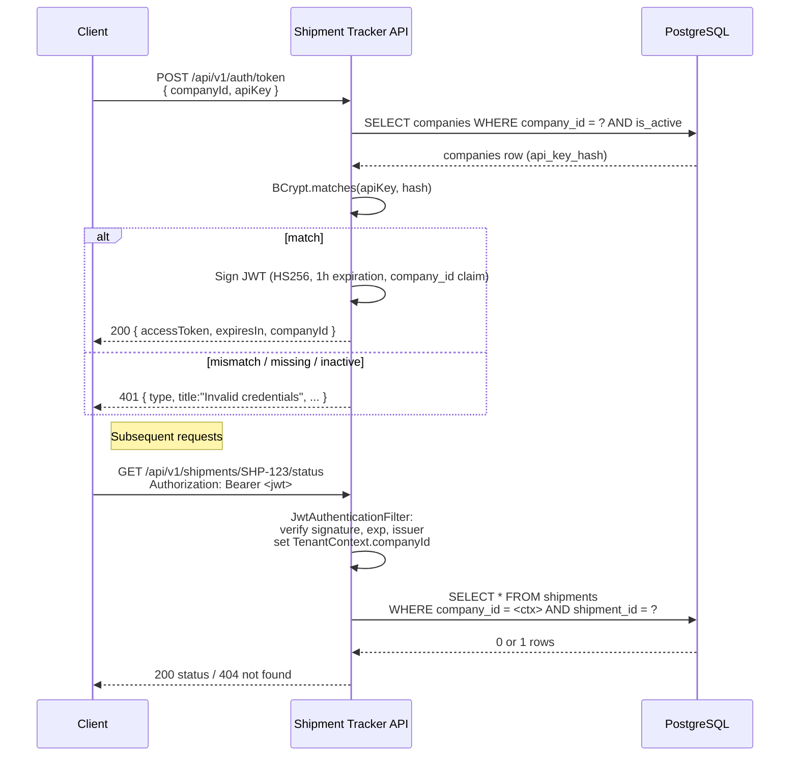

# API Design — Shipment Tracker

> Full OpenAPI 3.0 specification, auth flow, rate-limit strategy, error
> taxonomy, and validation rules for the Shipment Tracker API.
>
> The live spec is auto-generated from the controllers via springdoc-openapi
> at runtime — `/v3/api-docs` (JSON) and `/swagger-ui.html` (interactive).
> This document is the static source of truth.

---

## Table of Contents

1. [Overview](#overview)
2. [Authentication Flow](#authentication-flow)
3. [Rate Limiting](#rate-limiting)
4. [Error Codes](#error-codes)
5. [Validation Rules](#validation-rules)
6. [OpenAPI 3.0 Specification](#openapi-30-specification)

---

## Overview

| Endpoint | Method | Purpose |
|---|---|---|
| `/api/v1/auth/token` | POST | Exchange `companyId` + `apiKey` for a JWT |
| `/api/v1/shipments/{id}/events` | POST | Record a new shipment event |
| `/api/v1/shipments/{id}/events` | GET  | Paginated event history |
| `/api/v1/shipments/{id}/status` | GET  | Current status snapshot |
| `/api/v1/webhooks` | POST | Subscribe to event notifications |
| `/api/v1/webhooks/{webhookId}` | DELETE | Unsubscribe |

**Base URL** (local): `http://localhost:8080`
**Auth**: `Authorization: Bearer <jwt>` on every endpoint except `/auth/token` and `/actuator/health`.
**Content type**: `application/json` for both request and response bodies.

---

## Authentication Flow



### Token format

| Claim | Value |
|---|---|
| `iss` | `argus-shipment-tracker` |
| `sub` | The company UUID |
| `iat` | Issue time |
| `exp` | Issue time + 1 hour (configurable) |
| `company_id` | Custom claim — same as `sub`, kept explicit for clarity |

Algorithm: **HS256** (HMAC-SHA-256). Secret is base64-encoded, minimum 32 bytes. Override via the `JWT_SECRET` environment variable.

### Refresh tokens (future work)

Documented in `ARCHITECTURE.md`. Not implemented in v1 — clients re-auth before expiration.

---

## Rate Limiting

**Algorithm**: token bucket (Bucket4j).
**Granularity**: per `companyId`.

| Tier | Steady rate | Burst capacity |
|---|---|---|
| Authenticated | **1,000 req/min** | 100 |
| Unauthenticated (reserved) | 100 req/min | 20 |

### Headers on every response

| Header | Meaning |
|---|---|
| `X-RateLimit-Limit` | The burst capacity for this tenant |
| `X-RateLimit-Remaining` | Tokens remaining in the bucket |
| `Retry-After` | (only on 429) Seconds until the next token refills |
| `X-RateLimit-Reset` | (only on 429) Same as `Retry-After` |

### Production scaling

Bucket4j is in-memory in this build — fine for single-instance. For multi-instance, swap to **Bucket4j-Redis** (the proxy keeps buckets in Redis with atomic Lua-script operations) so all replicas share the same view.

---

## Error Codes

Every error response is **RFC 7807 Problem Details** — same shape across the API.

```json
{
  "type": "about:blank",
  "title": "Validation failed",
  "status": 400,
  "detail": "One or more fields failed validation",
  "instance": "/api/v1/shipments/SHP-1/events",
  "timestamp": "2026-05-07T20:00:00Z",
  "errors": [
    { "field": "location.latitude", "message": "latitude must be between -90 and 90", "rejectedValue": 999.0 }
  ]
}
```

### Status code taxonomy

| Status | When |
|---|---|
| **200 OK** | Successful read |
| **201 Created** | Resource created (event, webhook) |
| **204 No Content** | Successful delete (webhook) |
| **400 Bad Request** | Validation failure, malformed JSON, type mismatch |
| **401 Unauthorized** | Missing or invalid Bearer token / wrong API key |
| **403 Forbidden** | Token valid but does not grant access (reserved for future RBAC) |
| **404 Not Found** | Shipment / webhook does not exist for this tenant (tenant isolation also returns 404) |
| **429 Too Many Requests** | Rate limit exceeded — includes `Retry-After` |
| **500 Internal Server Error** | Unhandled server fault — stack trace logged, never leaked |

Tenant isolation deliberately returns **404 instead of 403** — exposing 403 would leak the existence of a resource owned by another tenant.

---

## Validation Rules

### POST /events — `CreateEventRequest`

| Field | Rule |
|---|---|
| `eventType` | Required. One of `PICKUP`, `IN_TRANSIT`, `OUT_FOR_DELIVERY`, `DELIVERED`, `EXCEPTION`, `RETURNED` |
| `timestamp` | Required. ISO-8601 with offset (e.g. `2026-05-07T14:30:00Z`) |
| `location.latitude` | Optional. `[-90, 90]` |
| `location.longitude` | Optional. `[-180, 180]` |
| `location.address` | Optional. ≤ 500 chars |
| `metadata` | Optional. Any JSON object |

### POST /webhooks — `CreateWebhookRequest`

| Field | Rule |
|---|---|
| `url` | Required. Must match `^https?://` and ≤ 2048 chars |
| `eventTypes` | Optional. Array of `EventType` enum values or `"*"`. Defaults to `["*"]` if absent |
| `description` | Optional. ≤ 255 chars |

### POST /auth/token — `TokenRequest`

| Field | Rule |
|---|---|
| `companyId` | Required. Valid UUID |
| `apiKey` | Required. Non-blank |

---

## OpenAPI 3.0 Specification

```yaml
openapi: 3.0.3
info:
  title: Shipment Tracker API
  version: v1
  description: |
    Real-time shipment event tracking. Records carrier events, exposes a
    unified status view, and notifies subscribed external systems via
    signed webhooks. Multi-tenant, JWT-authenticated, rate-limited.
  contact:
    name: Argus Logistics Engineering
    email: api@arguslogistics.com

servers:
  - url: http://localhost:8080
    description: Local development
  - url: https://api.shipment-tracker.example.com
    description: Production

security:
  - bearerAuth: []

tags:
  - name: Authentication
  - name: Shipments
  - name: Webhooks

paths:

  /api/v1/auth/token:
    post:
      tags: [Authentication]
      summary: Exchange company id + API key for a JWT access token
      security: []  # public
      requestBody:
        required: true
        content:
          application/json:
            schema:
              $ref: '#/components/schemas/TokenRequest'
      responses:
        '200':
          description: Token issued
          content:
            application/json:
              schema:
                $ref: '#/components/schemas/TokenResponse'
        '400': { $ref: '#/components/responses/BadRequest' }
        '401': { $ref: '#/components/responses/Unauthorized' }

  /api/v1/shipments/{shipmentId}/events:
    post:
      tags: [Shipments]
      summary: Record a new event for a shipment
      parameters:
        - $ref: '#/components/parameters/ShipmentId'
      requestBody:
        required: true
        content:
          application/json:
            schema:
              $ref: '#/components/schemas/CreateEventRequest'
            examples:
              inTransit:
                summary: A truck-pickup event with location and metadata
                value:
                  eventType: IN_TRANSIT
                  timestamp: "2026-05-07T14:30:00Z"
                  location:
                    latitude: 40.7128
                    longitude: -74.0060
                    address: "New York, NY"
                  metadata:
                    carrier: FastFreight
                    vehicle: TRUCK-789
      responses:
        '201':
          description: Event recorded
          content:
            application/json:
              schema:
                $ref: '#/components/schemas/EventResponse'
        '400': { $ref: '#/components/responses/BadRequest' }
        '401': { $ref: '#/components/responses/Unauthorized' }
        '404': { $ref: '#/components/responses/NotFound' }
        '429': { $ref: '#/components/responses/RateLimited' }
    get:
      tags: [Shipments]
      summary: Paginated event history (newest first)
      parameters:
        - $ref: '#/components/parameters/ShipmentId'
        - in: query
          name: page
          schema: { type: integer, minimum: 0, default: 0 }
        - in: query
          name: size
          schema: { type: integer, minimum: 1, maximum: 200, default: 50 }
      responses:
        '200':
          description: Page of events
          content:
            application/json:
              schema:
                $ref: '#/components/schemas/EventPage'
        '401': { $ref: '#/components/responses/Unauthorized' }
        '404': { $ref: '#/components/responses/NotFound' }
        '429': { $ref: '#/components/responses/RateLimited' }

  /api/v1/shipments/{shipmentId}/status:
    get:
      tags: [Shipments]
      summary: Current status snapshot (latest location, ETA, condition)
      parameters:
        - $ref: '#/components/parameters/ShipmentId'
      responses:
        '200':
          description: Status snapshot
          content:
            application/json:
              schema:
                $ref: '#/components/schemas/ShipmentStatusResponse'
        '401': { $ref: '#/components/responses/Unauthorized' }
        '404': { $ref: '#/components/responses/NotFound' }
        '429': { $ref: '#/components/responses/RateLimited' }

  /api/v1/webhooks:
    post:
      tags: [Webhooks]
      summary: Register a webhook subscription
      requestBody:
        required: true
        content:
          application/json:
            schema:
              $ref: '#/components/schemas/CreateWebhookRequest'
      responses:
        '201':
          description: Subscription created — secret returned exactly once
          content:
            application/json:
              schema:
                $ref: '#/components/schemas/WebhookResponse'
        '400': { $ref: '#/components/responses/BadRequest' }
        '401': { $ref: '#/components/responses/Unauthorized' }
        '429': { $ref: '#/components/responses/RateLimited' }

  /api/v1/webhooks/{webhookId}:
    delete:
      tags: [Webhooks]
      summary: Unregister a webhook subscription
      parameters:
        - in: path
          name: webhookId
          required: true
          schema: { type: string, format: uuid }
      responses:
        '204':
          description: Deleted
        '401': { $ref: '#/components/responses/Unauthorized' }
        '404': { $ref: '#/components/responses/NotFound' }

components:
  securitySchemes:
    bearerAuth:
      type: http
      scheme: bearer
      bearerFormat: JWT
      description: JWT issued by POST /api/v1/auth/token

  parameters:
    ShipmentId:
      in: path
      name: shipmentId
      required: true
      schema: { type: string, maxLength: 64 }
      example: SHP-DEMO-001

  schemas:
    TokenRequest:
      type: object
      required: [companyId, apiKey]
      properties:
        companyId: { type: string, format: uuid }
        apiKey:    { type: string, minLength: 1 }

    TokenResponse:
      type: object
      properties:
        accessToken: { type: string }
        tokenType:   { type: string, example: Bearer }
        expiresIn:   { type: integer, description: seconds }
        expiresAt:   { type: string, format: date-time }
        companyId:   { type: string, format: uuid }

    EventType:
      type: string
      enum: [PICKUP, IN_TRANSIT, OUT_FOR_DELIVERY, DELIVERED, EXCEPTION, RETURNED]

    Location:
      type: object
      properties:
        latitude:  { type: number, minimum: -90,  maximum: 90 }
        longitude: { type: number, minimum: -180, maximum: 180 }
        address:   { type: string, maxLength: 500 }

    CreateEventRequest:
      type: object
      required: [eventType, timestamp]
      properties:
        eventType: { $ref: '#/components/schemas/EventType' }
        timestamp: { type: string, format: date-time }
        location:  { $ref: '#/components/schemas/Location' }
        metadata:  { type: object, additionalProperties: true }

    EventResponse:
      type: object
      properties:
        eventId:    { type: string, example: "EVT-550e8400-e29b-41d4-a716-446655440000" }
        shipmentId: { type: string }
        eventType:  { $ref: '#/components/schemas/EventType' }
        timestamp:  { type: string, format: date-time }
        receivedAt: { type: string, format: date-time }
        location:   { $ref: '#/components/schemas/Location' }
        metadata:   { type: object, additionalProperties: true }

    EventPage:
      type: object
      properties:
        content:
          type: array
          items: { $ref: '#/components/schemas/EventResponse' }
        page:          { type: integer }
        size:          { type: integer }
        totalElements: { type: integer, format: int64 }
        totalPages:    { type: integer }
        first:         { type: boolean }
        last:          { type: boolean }

    ShipmentStatusResponse:
      type: object
      properties:
        shipmentId:    { type: string }
        currentStatus:
          type: string
          enum: [CREATED, PICKUP, IN_TRANSIT, OUT_FOR_DELIVERY, DELIVERED, EXCEPTION, RETURNED, CANCELLED]
        lastEventAt:   { type: string, format: date-time }
        lastLocation:  { $ref: '#/components/schemas/Location' }
        estimatedEta:  { type: string, format: date-time }
        origin:        { type: string }
        destination:   { type: string }
        carrier:       { type: string }

    CreateWebhookRequest:
      type: object
      required: [url]
      properties:
        url:
          type: string
          format: uri
          pattern: ^https?://
          maxLength: 2048
        eventTypes:
          type: array
          description: 'Array of event-type names or "*" (all). Defaults to ["*"].'
          items: { type: string }
        description: { type: string, maxLength: 255 }

    WebhookResponse:
      type: object
      properties:
        webhookId:   { type: string, format: uuid }
        url:         { type: string }
        eventTypes:  { type: array, items: { type: string } }
        description: { type: string }
        active:      { type: boolean }
        secret:
          type: string
          description: HMAC-SHA-256 signing secret. Returned exactly once at creation.
        createdAt:   { type: string, format: date-time }

    ErrorResponse:
      type: object
      description: RFC 7807 Problem Details
      properties:
        type:      { type: string }
        title:     { type: string }
        status:    { type: integer }
        detail:    { type: string }
        instance:  { type: string }
        timestamp: { type: string, format: date-time }
        errors:
          type: array
          items:
            type: object
            properties:
              field:         { type: string }
              message:       { type: string }
              rejectedValue: {}

  responses:
    BadRequest:
      description: Validation failed or malformed request
      content:
        application/json:
          schema: { $ref: '#/components/schemas/ErrorResponse' }
    Unauthorized:
      description: Missing or invalid Bearer token
      content:
        application/json:
          schema: { $ref: '#/components/schemas/ErrorResponse' }
    NotFound:
      description: Resource not found (or not visible to this tenant)
      content:
        application/json:
          schema: { $ref: '#/components/schemas/ErrorResponse' }
    RateLimited:
      description: Rate limit exceeded — see Retry-After
      headers:
        Retry-After:
          schema: { type: integer }
          description: Seconds until the next refill
      content:
        application/json:
          schema: { $ref: '#/components/schemas/ErrorResponse' }
```

---

## Webhook delivery contract

When a shipment event is recorded, the API POSTs to every active subscriber URL with this body:

```json
{
  "eventId":     "550e8400-e29b-41d4-a716-446655440000",
  "shipmentId":  "SHP-DEMO-001",
  "companyId":   "11111111-1111-1111-1111-111111111111",
  "eventType":   "IN_TRANSIT",
  "timestamp":   "2026-05-07T14:30:00Z",
  "location":    { "latitude": 40.7128, "longitude": -74.0060, "address": "New York, NY" },
  "metadata":    { "carrier": "FastFreight", "vehicle": "TRUCK-789" }
}
```

### Headers

| Header | Value |
|---|---|
| `Content-Type` | `application/json` |
| `X-Shipment-Tracker-Signature` | `sha256=<hex>` — HMAC-SHA-256 of the body using the webhook secret |
| `X-Shipment-Tracker-Timestamp` | Epoch milliseconds, used to prevent replay |

### Subscriber verification (pseudocode)

```python
import hmac, hashlib

def verify(body: bytes, signature: str, secret: str) -> bool:
    expected = "sha256=" + hmac.new(secret.encode(), body, hashlib.sha256).hexdigest()
    return hmac.compare_digest(expected, signature)
```

### Retry policy

5 attempts with exponential backoff: **1s → 2s → 4s → 8s → 16s** (max 60s). Every attempt is logged to `webhook_delivery_logs`. After all retries fail, `consecutive_failures` increments — operators can use this to disable flaky subscribers.
